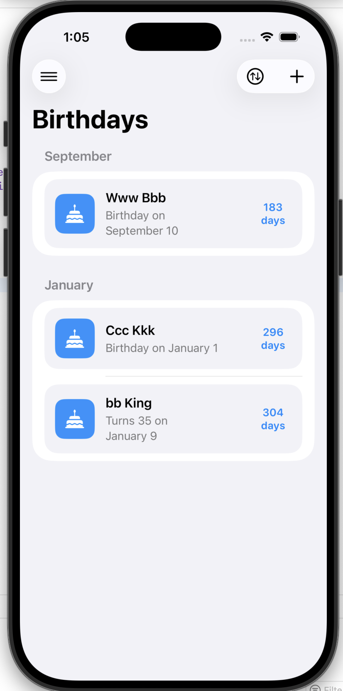

# Birthdays 🎂

Birthdays is a small iPhone app for keeping track of birthdays, setting reminders, and making sure important dates do not quietly sneak past you.

Right now the project is set up for local development with a Personal Team in Xcode. Birthday data is stored locally with SwiftData, and the app keeps a future path open for CloudKit-backed iCloud sync when a paid Apple Developer account is available.

## What It Does ✨

- Manual birthday creation and editing
- Required month/day with optional birth year
- Birthday list grouped by month
- Sorting by upcoming date, first name, and last name
- Global reminder settings
- Per-person reminder disable switch
- Configurable notification time
- February 29 fallback handling
- Swipe-to-delete from the birthday list
- CSV import and export
- Local persistence with SwiftData
- Local notifications with `UserNotifications`

## Current Status 🚧

Implemented:

- Birthday list UI
- Add/edit birthday flow
- Settings screen
- Reminder scheduling
- Notification permission handling
- CSV import and export
- Local data persistence
- UI test scaffolding for core flows

Not currently available in Personal Team mode:

- Real iCloud / CloudKit sync
- Cross-device sync verification

## Tech Stack 🛠️

- SwiftUI
- SwiftData
- UserNotifications
- XCTest / XCUITest

## Preview 📱



## Project Structure 📁

```text
Birthdays/
├── Birthdays.xcodeproj
├── Birthdays/
│   ├── Features/
│   ├── Models/
│   ├── Services/
│   ├── Stores/
│   ├── Assets.xcassets/
│   ├── BirthdaysApp.swift
│   └── ContentView.swift
├── BirthdaysTests/
├── BirthdaysUITests/
├── spec.md
└── tasks.md
```

## Getting Started 🚀

### Requirements

- Xcode 26 or newer
- iOS Simulator

### Run the App

1. Open [`Birthdays.xcodeproj`](Birthdays/Birthdays.xcodeproj) in Xcode.
2. Select the `Birthdays` scheme.
3. Choose an iPhone simulator.
4. Press `Run`.

## Personal Team Note 👀

If you use a free Personal Team in Xcode, the app runs in local-only mode.

That means:

- Birthday data is stored on device with SwiftData
- Notifications work normally
- iCloud sync is disabled in the active project configuration

When you later move to a paid Apple Developer account, you can re-enable:

- iCloud / CloudKit capability in Xcode
- CloudKit-backed SwiftData configuration
- Cross-device sync verification

## Testing 🧪

Build from the command line:

```bash
xcodebuild -project Birthdays/Birthdays.xcodeproj -scheme Birthdays -sdk iphonesimulator build
```

Run unit tests:

```bash
xcodebuild -project Birthdays/Birthdays.xcodeproj -scheme Birthdays -destination 'platform=iOS Simulator,name=iPhone 17 Pro' test -only-testing:BirthdaysTests
```

Run UI tests:

```bash
xcodebuild -project Birthdays/Birthdays.xcodeproj -scheme Birthdays -destination 'platform=iOS Simulator,name=iPhone 17 Pro' test -only-testing:BirthdaysUITests
```

## Roadmap 🗺️

- Finish full manual verification checklist
- Stabilize full test runs in the local environment
- Re-enable CloudKit when a paid developer account is available
- Improve CSV import validation and conflict handling

## Documentation 📚

- [`spec.md`](spec.md): product and technical specification
- [`tasks.md`](tasks.md): implementation checklist and remaining work
